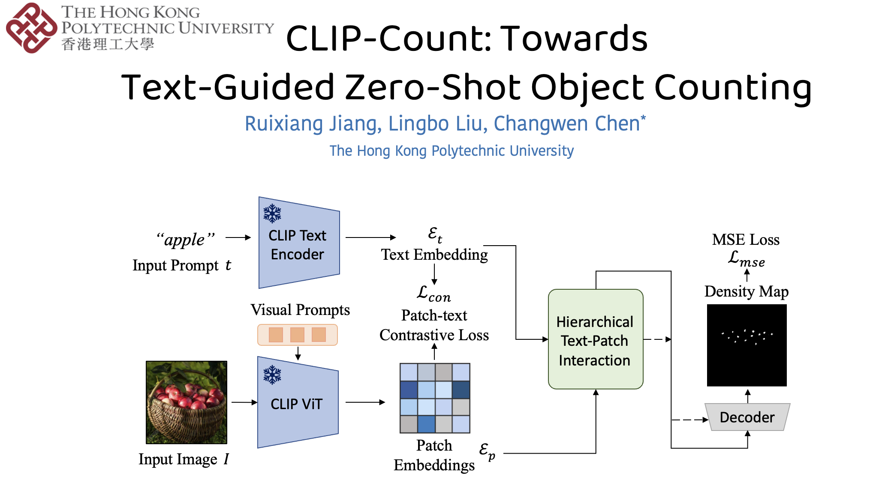
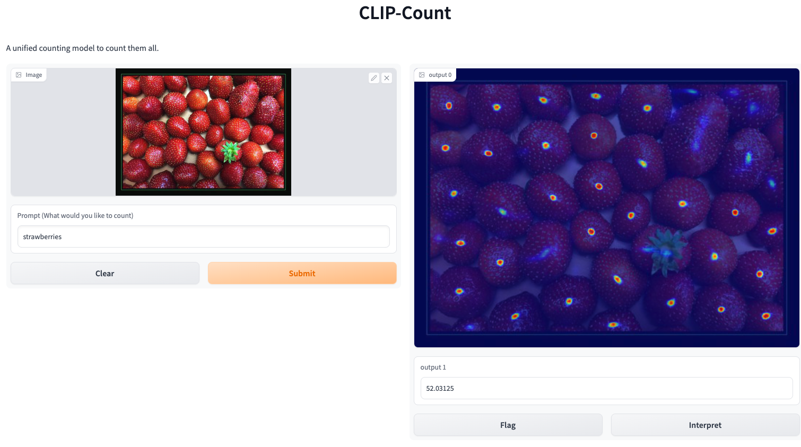

# CLIP-Count: Towards Text-Guided Zero-Shot Object Counting




Official Implementation for ACM Multimedia 2023 paper CLIP-Count: Towards Text-Guided Zero-Shot Object Counting. Paper at: [arXiv](https://arxiv.org/abs/2305.07304).
TL;DR: We count anything with text descriptions.

**Update**


🔥🔥🔥 [Jul 26] Our paper is accepted by ACM Multimedia 2023.  

🔥🔥🔥 [Aug 12] The code and pretrained model is released.
## Preparation

**Environment:** Create a virtural environment use Anaconda, and install all dependencies.
```
conda create -n clipcount python=3.8 -y;
conda activate clipcount;
conda install pytorch==1.10.0 torchvision==0.11.0 torchaudio==0.10.0 cudatoolkit=10.2 -c pytorch
# For GPU with CUDA version 11.x, please use:
# conda install pytorch==1.10.0 torchvision==0.11.0 torchaudio==0.10.0 cudatoolkit=11.3 -c pytorch -c conda-forge
pip install -r requirements.txt
pip install ftfy regex tqdm
pip install git+https://github.com/openai/CLIP.git
```
**Data:** We conduct experiments over three datasets, you can downloaded and use whichever you would like to test.
The three dataset could be downloaded at: [FSC-147](https://github.com/cvlab-stonybrook/LearningToCountEverything) | [CARPK](https://lafi.github.io/LPN/) | [ShanghaiTech](https://www.kaggle.com/datasets/tthien/shanghaitech).
Notice that you have to download the annoations of FSC-147 separately from their repo.

Extract and put the downloaded data in the `data/` dir. The complete file structure should look like this. You don't have to download all the dataset for evaluation, but you must have FSC-147 if you want to train the model.
```
data
├─CARPK/
│  ├─Annotations/
│  ├─Images/
│  ├─ImageSets/
│
├─FSC/    
│  │ 
│  ├─gt_density_map_adaptive_384_VarV2/
│  ├─images_384_VarV2/
│  ├─FSC_147/
│  │  ├─ImageClasses_FSC147.txt
│  │  ├─Train_Test_Val_FSC_147.json
│  │  ├─ annotation_FSC147_384.json
│  
├─ShanghaiTech/
│  ├─part_A/
│  ├─part_B/
```

## Run the Code
📘 **Train**. you can train the model using the following command. For first time you run the code, the forzen CLIP weight would be downloaded. 
```
CUDA_VISIBLE_DEVICES=0 python run.py --mode train --exp_name exp --batch_size 32
```
Notice that the MAE logged during training is lower than the testing time, this is because training image is cropped from the whole image, while testing time sliding windows algorithm is applied.

---
🧰 **Evaluation**. Test the performance of trained ckpt with following command. You can change the `--dataset_type` parameter to test on different datasets.
```
CUDA_VISIBLE_DEVICES=0 python run.py --mode test --exp_name exp --batch_size 32 --dataset_type FSC --ckpt path/to/model.ckpt
```

We provide a [pre-trained ckpt](https://drive.google.com/file/d/17Dj0tjd29lPGOGYEF5IrE8aPClXUjTrR/view?usp=drive_link) of our full model, which has similar quantitative result as presented in the paper. 
| FSC val MAE | FSC val RMSE | FSC test MAE |  FSC test RMSE | CARPK MAE | CARPK RMSE |
|-------------|--------------|--------------|----------------|-----------|------------|
| 18.93       | 66.10        | 17.45        | 104.88         | 11.70     | 13.94      |

| Part-A MAE | Part-A RMSE | Part-B MAE | Part-B RMSE |
|------------|-------------|------------|-------------|
| 197.47     | 319.75      | 47.92      | 80.48       |

---

💻 **Interactive Web App**. We provide a user-friendly interface to let you interact with CLIP-Count. You can start a web app using following command:

```
CUDA_VISIBLE_DEVICES=0 python run.py --mode app --exp_name exp --batch_size 32 --ckpt path/to/model.ckpt
```

You can follow the instructions on the terminal to visit the interface,
```
$ Running on local URL:  http://127.0.0.1:xxxx
$ Running on public URL: https://xxxxxxxx-xxxx-xxxx.gradio.live

$ This share link expires in 72 hours. For free permanent hosting and GPU upgrades (NEW!), check out Spaces: https://huggingface.co/spaces
```
The interface would look like this. You can upload images and input prompts to test the model.




## Citation
```
@article{jiang2023clip,
  title={CLIP-Count: Towards Text-Guided Zero-Shot Object Counting},
  author={Jiang, Ruixiang and Liu, Lingbo and Chen, Changwen},
  journal={arXiv preprint arXiv:2305.07304},
  year={2023}
}

```

## Acknoledgement

This project is based on implementation from [CounTR](https://github.com/Verg-Avesta/CounTR).
